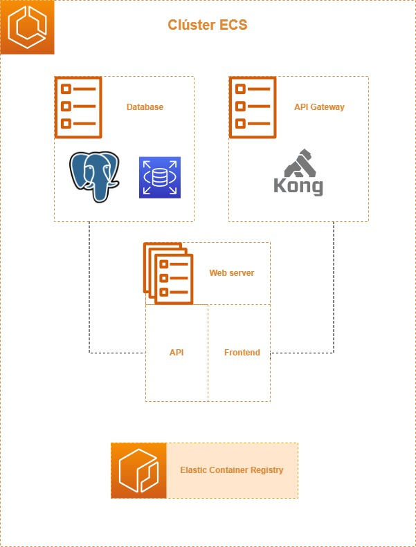

# ADR Despliegue

* Estado: aceptada
* Responsables:
    * Unai Biurrun Villacorta
    * Jorge Bruned Alamán
    * Iñaki Velasco Rodríguez
* Fecha: 01-05-2023

# Introducción

En este documento se recoge la información relativa a las decisiones iniciales en cuanto a la arquitectura en la nube del sistema.
Para cada decisión, se listan las opciones consideradas junto a una breve descripción, ventajas y contras, así como la decisión final tomada.

El formato a seguir será una sección para cada uno de los microservicios que componen el sistema, así como una sección para la integración de los mismos.

Además, se parte de la base de que el despliegue se hará en la nube, concretamente en AWS, por requisito del cliente.
Por tanto, no se considerarán otras opciones como despliegue *on-premise* o en otras plataformas como Azure o Google Cloud.

## Tabla de contenidos

<!-- TOC -->
* [Introducción](#introducción)
    * [Tabla de contenidos](#tabla-de-contenidos)
    * [Factores en la decisión](#factores-en-la-decisión)
* [Servidor web](#servidor-web)
    * [API + Frontend en el mismo servicio](#api--frontend-en-el-mismo-servicio)
    * [API y Frontend en servicios separados](#api-y-frontend-en-servicios-separados)
    * [Decisión](#decisión)
* [Base de datos](#base-de-datos)
    * [Base de datos en el mismo servicio](#base-de-datos-en-el-mismo-servicio)
    * [Base de datos PostgreSQL en servicio independiente](#base-de-datos-postgresql-en-servicio-independiente)
    * [Base de datos nativa de AWS (RDS)](#base-de-datos-nativa-de-aws-rds)
    * [Decisión](#decisión-1)
* [API Gateway](#api-gateway)
    * [Uso de API Gateway (Kong)](#uso-de-api-gateway-kong)
    * [Redirección directa al servidor web](#redirección-directa-al-servidor-web)
    * [Uso del API Gateway de AWS](#uso-del-api-gateway-de-aws)
    * [Decisión](#decisión-2)
* [Arquitectura resultante](#arquitectura-resultante)
    * [Despliegue en AWS](#despliegue-en-aws)
    * [Presupuesto](#presupuesto)
<!-- TOC -->

## Factores en la decisión

Para tomar la decisión se han priorizado los siguientes factores:

* Sencillez de configuración
* Precio
* Escalabilidad
* Posibilidad de automatización

# Servidor web

Este servicio es totalmente imprescindible. En nuestro caso, se han contemplado dos opciones, que se describen a continuación.

## API + Frontend en el mismo servicio

En esta opción, el servidor web contendría tanto la API como el frontend. Esto es, el servidor web se encargaría de servir los archivos estáticos del frontend en la raíz `/`, así como de redirigir las peticiones a la API en la ruta `/api`.

- Ventajas:
    - Sencillez de configuración
    - Despliegue simultáneo mediante una única imagen de *Docker*
    - Precio (solo se necesita un servicio)
- Desventajas:
    - No se puede escalar de forma independiente el frontend y la API
    - Si el API se cae o se reinicia, se cae también el frontend
    - No se puede reemplazar de forma independiente el frontend y la API

## API y Frontend en servicios separados

En esta opción, existiría un servicio para el frontend y otro para la API, cada uno con su propio servidor web.
En este caso, sería imprescindible contar con un API gateway o un balanceador de carga que redirija las peticiones
a cada uno de los servicios.

- Ventajas:
    - Se puede escalar de forma independiente cada uno de los servicios
    - Podemos actualizar la versión del API sin afectar al frontend
    - Mientras el API se reinicia, el frontend sigue funcionando y muestra un mensaje al usuario
    - Se puede reemplazar de forma independiente el frontend y la API
    - Posibilidad de usar un servidor estático o un CDN para el frontend, lo que reduce el coste y optimiza el rendimiento
- Desventajas:
    - Configuración más compleja
    - Necesidad de un API gateway o balanceador de carga
    - Necesidad de dos procesos de despliegue
    - Precio (se necesitan dos servicios)

## Decisión

Se ha optado por la primera opción, ya que es más sencilla de configurar y desplegar, y además es más barata.
Además, se ajusta más a la arquitectura actual desplegada en local y no se considera necesario escalar de forma independiente el frontend y la API a corto plazo. Sería relativamente sencillo cambiar a la segunda opción en el futuro si fuera necesario.

# Base de datos

La base de datos es el segundo de los servicios desplegados en local. Sin embargo, existe la opción de desplegarla en el mismo servicio que el API o en un servicio separado. También se ha considerado la posibilidad de usar la base de datos de AWS. A continuación, se presentan y describen las opciones consideradas.

## Base de datos en el mismo servicio

En esta opción, la base de datos se desplegaría en el mismo servicio que el API. Esto es fácilmente realizable ya que
disponemos de una variable de entorno `USE_POSTGRES`, que en caso de ser `False` utiliza una base de datos de SQLite
por defecto dentro del propio servicio. En caso de ser `True`, se utiliza una base de datos de PostgreSQL.

- Ventajas:
    - Sencillez de configuración
    - Prescindimos de un servicio
- Desventajas:
    - No se puede escalar de forma independiente el servidor web y la base de datos
    - De hecho, imposibilita crear más de una instancia del servidor web (puesto que cada instancia tendría su propia base de datos) 
    - Fuerte acoplamiento entre el API y la base de datos
    - No se puede reemplazar ni reiniciar a base de datos sin afectar al API
    - Si la base de datos se cae o se reinicia, se cae también el API (¡y el frontend si están en el mismo servicio!)

## Base de datos PostgreSQL en servicio independiente

En esta opción, la base de datos se desplegaría en un servicio independiente, tal y como se hace en local. Esto es,
se desplegaría un servicio de PostgreSQL y se configuraría el API para que se conecte a él. Esto es fácilmente realizable
gracias a las variables de entorno, que creamos en su día con la mirada puesta en el despliegue en la nube.

- Ventajas:
    - Se puede escalar de forma independiente el servidor web y la base de datos
    - Se puede crear más de una instancia del servidor web
    - Se puede reemplazar o reiniciar la base de datos sin afectar al API
    - La arquitectura local ya está desplegada de esta forma
    - Conocimiento de la herramienta
- Desventajas:
    - Configuración más compleja
    - Necesidad de un servicio adicional

## Base de datos nativa de AWS (RDS)

En esta opción, la base de datos se desplegaría en un servicio de AWS, concretamente en RDS.

- Ventajas:
    - Prescindimos de un servicio
    - Escalabilidad
    - BD gestionada por AWS
    - Precio (en principio es más barato que desplegar un servicio de *PostgreSQL*)
- Desventajas:
    - Desconocimiento de la herramienta
    - Necesidad de configuración adicional
    - Mayor dependencia de AWS, lo que dificulta la migración a otro proveedor

## Decisión

Se ha optado por la segunda opción, ya que es más sencilla de configurar y desplegar, además de que ya está desplegada en local. Además, se ajusta más a la arquitectura actual desplegada en local y no se considera necesario utilizar RDS en las circunstancias actuales. Sin embargo, a fecha de hoy (entrega del RFI III), se ha desplegado la base de datos junto al API (primera opción), ya que se ha considerado que es más importante tener el servicio desplegado cuanto antes y en las próximas semanas se realizará el cambio a la segunda opción, que  implemente requiere crear el servicio de PostgreSQL y configurar las variables de entorno mencionadas anteriormente. Así mismo, no nos cerramos a la posibilidad de utilizar RDS en el futuro, si se considera necesario.

# API Gateway

El API Gateway es el tercer servicio desplegado en local. Sin embargo, es un servicio prescindible, ya que se pueden dirigir las peticiones al servidor web directamente. También podríamos utilizar el API Gateway de AWS. A continuación,
se presentan y describen las opciones consideradas.

## Uso de API Gateway (Kong)

En esta opción, se desplegaría un servicio de API Gateway que redirigiría las peticiones al servidor web. Esto es,
replicaríamos la arquitectura actual desplegada en local.

- Ventajas:
    - Captura de logs
    - Escalabilidad
    - Posibilidad de redirigir las peticiones a distintos servicios (si, por ejemplo, el API y el frontend estuvieran en servicios distintos)
    - Posibilidad de proteger ciertos endpoints con autenticación (por ejemplo, mediante tokens)
    - La arquitectura local ya está desplegada de esta forma
    - Conocimiento de la herramienta
- Desventajas:
    - Configuración más compleja
    - Necesidad de un servicio adicional
    - Precio (por el mismo motivo)
    - Punto de fallo adicional
    - Posible cuello de botella si no se escala debidamente

## Redirección directa al servidor web

En esta opción, se redirigirían las peticiones al servidor web directamente, sin pasar por un API Gateway.

- Ventaas:
    - Sencillez de configuración
    - Prescindimos de un servicio
    - Menor latencia (potencialmente)
    - Menor precio al no necesitar un servicio adicional
- Desventajas:
    - Perdemos las ventajas del API Gateway: no se capturan logs, proteger ciertos endpoints, etc.

## Uso del API Gateway de AWS

En esta opción, se utilizaría el API Gateway de AWS, que es un servicio que ofrece AWS de forma nativa.

- Ventajas:
    - Prescindimos de un servicio
    - Precio (en principio es más barato que desplegar un servicio de *API Gateway*)
- Desventajas:
    - Desconocimiento de la herramienta
    - Necesidad de configuración adicional
    - Mayor dependencia de AWS, lo que dificulta la migración a otro proveedor

## Decisión

Al igual que en el caso de la base de datos, hemos decidido mantener por el momento la arquitectura actual desplegada en local, es decir, replicaríamos la arquitectura actual desplegada en local. Sin embargo, a fecha de hoy (entrega del RFI III), no se ha desplegado el API Gateway, ya que se ha considerado que es más importante tener el servicio desplegado cuanto antes y en las próximas semanas se realizará el cambio a la primera opción, que simplemente requiere crear el servicio de API Gateway y configurar las rutas. Así mismo, no nos cerramos a la posibilidad de utilizar     el API Gateway de AWS en el futuro, si se considera necesario.

# Arquitectura resultante

A continuación, se presenta la arquitectura resultante, recogida en el siguiente diagrama:

Cabe destacar que, actualmente, solo se ha desplegado el servidor web con el API y el frontend, y la base de datos
está integrada en el mismo. En las próximas semanas se desplegará la base de datos en un servicio independiente y
se configurará el API gateway.

## Despliegue en AWS

Para automatizar el despliegue de la arquitectura en AWS, se utilizará *Terraform*, por ser la herramienta más
extendida y, al mismo tiempo, un requisito del cliente. Además, se utilizarán imágenes de *Docker* para desplegar
los servicios; concretamente, para el servicio con el API y el frontend se utilizará la imagen de *Docker* que ya se
ha creado en anteriores iteraciones del desarrollo. Para el servicio de base de datos, se utilizará la imagen
oficial de *PostgreSQL* y para el servicio de API Gateway, se utilizará la imagen oficial de *Kong*.

La automatización del despliegue se incorporará a la versión final del proyecto, y se incluirá en el pipeline de CI/CD.
En este RFI, se ha realizado el despliegue manualmente, para comprobar que la arquitectura funciona correctamente. La
única parte que ya se ha automatizado es la publicación de la imagen de *Docker* del servidor web en *ECR* desde la
pipeline de CI/CD de *Github Actions*.

## Presupuesto

A continuación, se presenta el presupuesto de la arquitectura de AWS detallada anteriormente durante un año:

### Web server (API + Front)
Se ha hecho uso de AWS Fargate por lo que los factores a considerar serán los siguientes:
* Precio por CPU virtual por hora: 0,04656 USD 
* Precio por GB por hora: 0,00511 USD
* Configuración actual: 0.5 vCPUs, 1GB

Con estas consideraciones, el precio anual final para este servicio sería:
(0.04656 x 0.5 + 0.00511) x 24 x 365 = 248.70 USD/año (a considerar el número de tareas activas)

En este caso, y para el siguiente RFI, se considerará la opción de hacer uso de EC2 debido a su gratuidad de 750 horas mensuales para ciertas instancias. Se valorará teniendo en cuenta la complejidad de su implementación respecto a lo ya implementado actualmente.

### Base de datos
Suponiendo el uso de un servicio propio tendría el mismo coste que el Web server.

En el caso de hacer uso de las tecnologías de AWS, Amazon RDS, sería gratuito ya que, de nuevo, se cubren un total de 750 horas mensuales, 20 GB de almacenamiento y 20GB de copias de seguridad.

### API Gateway
Suponiendo el uso de un servicio propio tendría el mismo coste que el Web server.

### Presupuesto final
Se detalla a continuación una horquilla de presupuesto entre el mínimo y el máximo posible que se podría llegar a tener.

**Mínimo presupuesto anual:** en el caso de hacer uso de AWS Fargate para el Web server, un servicio propio también en Fargate para la base de datos y otro para el API Gateway.
(0.04656 x 0.5 + 0.00511) x 24 x 365 x 3 = **746.10 USD/año** (a considerar el número de tareas activas)

**Máximo presupuesto anual:** en el caso de hacer uso de AWS EC2 en lugar de AWS Fargate para el Web server, la tecnología RDS de Amazon para la base de datos y no dedicar un servicio propio al API Gateway.
 **0 USD/año** (a considerar el número de tareas activas)

