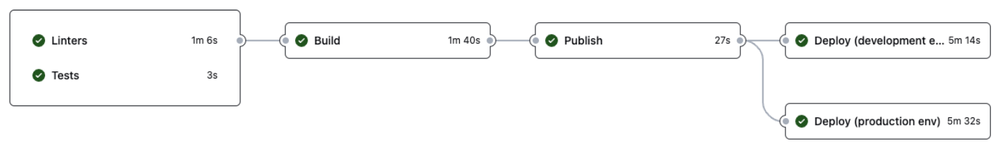

# ADR Despliegue (cloud)<!-- omit from toc -->

* Estado: aceptada
* Responsables:
    * Unai Biurrun Villacorta
    * Jorge Bruned Alamán
    * Iñaki Velasco Rodríguez
* Fecha: 24-05-2023

# Introducción

En este documento se recoge la información relativa a las decisiones iniciales en cuanto a la tecnología para el despliegue en la nube del sistema.
Para cada decisión, se listan las opciones consideradas junto a una breve descripción, ventajas y contras, así como la decisión final tomada.

El formato a seguir será una sección para cada una de las decisiones relevantes tomadas, así como una sección para la integración de los mismos.

Además, se parte de la base de que el despliegue se hará en cloud, concretamente en AWS, por requisito del cliente y por decisiones tomadas en anteriores RFIs.

- Para un despliegue *on-premise*, se ofrece a los clientes la posibilidad de desplegar el servicio en local utilizando *Docker Compose* → [ADR Despliegue en local](./Deployment_Local.md).
Es por ello que en este documento no se considerarán otras opciones como despliegue *on-premise* o en otras plataformas como Azure o Google Cloud.

## Tabla de contenidos

<!-- TOC -->
* [Introducción](#introducción)
  * [Tabla de contenidos](#tabla-de-contenidos)
  * [Factores en la decisión](#factores-en-la-decisión)
* [Herramienta de despliegue](#herramienta-de-despliegue)
  * [Decisión](#decisión)
* [Seguridad y configuración de los microservicios](#seguridad-y-configuración-de-los-microservicios)
  * [Configuración de BD y API gateway](#configuración-de-bd-y-api-gateway)
  * [Inicialización del *API gateway*](#inicialización-del-api-gateway)
* [Almacenamiento del estado de *Terraform*](#almacenamiento-del-estado-de-terraform)
  * [Opción elegida](#opción-elegida)
* [Paralelización de entornos](#paralelización-de-entornos)
* [Arquitectura resultante](#arquitectura-resultante)
<!-- TOC -->

## Factores en la decisión

Para tomar la decisión se han priorizado los siguientes factores:

* Sencillez de configuración
* Velocidad de despliegue
* Escalabilidad
* Posibilidad de automatización

# Herramienta de despliegue

Veíamos muy importante utilizar una herramienta "*infrastucture as code*" como *Terraform* o *CloudFormation* para automatizar el despliegue y poder replicarlo en cualquier momento, aplicando los cambios necesarios en cada momento, y pudiendo desplegar en varios entornos. Esto, además, se alinea con los requisitos del cliente, que impuso como requisito el uso de *Terraform*. Por tanto, se ha optado por utilizar *Terraform* para el despliegue.

Aunque el despliegue manual nunca se ha considerado como una opción, se van a discutir brevemente las ventajas que nos ofrece *Terraform* frente a un despliegue manual:

- **Sencillez de ejecución**: *Terraform* nos permite definir la infraestructura como código, lo que nos permite automatizar el despliegue y replicarlo en cualquier momento. De forma manual, resulta demasiado propenso a errores humanos o fallos de configuración.

- **Velocidad de despliegue**: *Terraform* nos permite desplegar la infraestructura en cuestión de minutos, mientras que un despliegue manual puede llevar horas y es mucho más variable.

- **Escalabilidad**: *Terraform* nos permite escalar la infraestructura de forma sencilla, mientras que un despliegue manual puede ser muy complejo. Además, podemos escalar de forma independiente cada uno de los componentes de la infraestructura, y crear múltiples entornos de forma sencilla utilizando el mismo código y algunas variables de configuración para hacer cambios en cada entorno. En nuestro caso, vamos a desplegar dos entornos: *desarrollo* y *producción*, aunque también consideramos un entorno de *preproducción*.

- **Posibilidad de automatización**: *Terraform* nos permite automatizar el despliegue, mientras que un despliegue manual, como su nombre indica, obviamente no. Esto nos da pie a poder incluir el despliegue en un pipeline de CI/CD, como va a ser nuestro caso.

- **Control de versiones**: *Terraform* nos permite controlar la versión de la infraestructura, lo que nos permite hacer cambios en la infraestructura de forma controlada y poder revertirlos en caso de error. Esto es especialmente importante en un entorno de producción, donde no podemos permitirnos errores.

- **Gestión del estado**: *Terraform* nos permite gestionar el estado de la infraestructura, lo que nos permite saber en todo momento el estado de la infraestructura y poder hacer cambios en ella de forma controlada. Además, si en un determinado momento queremos destuir la infraestructura, *Terraform* conoce qué recursos están asociados a la misma y los destruye de forma automática y controlada.

- **Reutilización de código**: *Terraform* nos permite reutilizar código, lo que nos permite crear módulos que podemos reutilizar en diferentes proyectos. Esto nos permite ahorrar tiempo y esfuerzo, y nos permite crear una infraestructura más robusta y estandarizada.

- **Comunidad**: *Terraform* es una herramienta muy popular, por lo que cuenta con una gran comunidad detrás que nos puede ayudar en caso de duda o problema.

- **Integración con otros servicios**: *Terraform* nos permite integrar otros servicios, no solo *AWS* sino que tiene proveedores (*providers*) para distintos tipos de BBDD, proveedores de servicios, dominios, etc. Esto nos permite definir toda la infraestructura en un solo sitio.

## Decisión

Como soe ha mencionado, la decisión tomada es utilizar *Terraform* para el despliegue de la infraestructura; no solo por los numerosos beneficios descritos anteriormente, sino porque además es un requisito del cliente.

# Seguridad y configuración de los microservicios

Si bien es muy cómodo para el desarrollador tener acceso directo a las máquinas para poder hacer cambios en ellas (véase la base de datos, API gateway o servicios configurables por el estilo), esto presenta problemas de seguridad. Por tanto, se ha decidido crear una red privada donde se desplegarán los servicios, y se accederá a ellos a través de un *bastion host*. Los grupos de seguridad estarán configurados de tal forma que desde internet solo se pueda acceder al puerto expuesto (en este caso, el puerto web). El *bastion host* será el único que tenga acceso a todos los servicios internos, y será el único que tenga acceso a internet. El desarrollador podrá acceder a las máquinas a través del *bastion host* utilizando una conexión SSH o directamente alguno de los puertos redireccionados del bastion host. Para asegurarnos de que esto se cumple, en el momento de creación del *bastion host* se añadirá tan solo la dirección IP actual a la lista de IPs permitidas del grupo de seguridad. Esto es posible gracias al uso de *Terraform*, que nos permite obtener la dirección IP actual y añadirla al grupo de seguridad automáticamente.

## Configuración de BD y API gateway

Como se ha mencionado, la base de datos y el API gateway necesitan una configuración inicial. En el caso de la instancia de *RDS*, se necesitan crear las bases de datos junto a sus usuarios y permisos; y en el caso del API gateway, se necesita crear los servicios, rutas, redirecciones, consumidores y reglas de seguridad pertinentes.

Se han considerado las siguientes opciones:
- Inicialización manual exponiéndolos a internet: descartado por dos motivos: la seguridad y la automatización. Exponerlos a internet es un riesgo de seguridad, y además no es posible automatizarlo.
- Inicialización manual a través del *bastion host*: descartado por el mismo motivo que el anterior: no es posible automatizarlo.
- Inicialización mediante un script en el *bastion host*: se contempló como una posible opción, pero no ofrece algunas de las ventajas que la siguiente alternativa sí ofrece.
- Inicialización mediante *providers* de *Terraform*: esta es la opción elegida, ya que nos permite automatizar la inicialización de los servicios, y además nos permite controlar el estado de los mismos. Esto es especialmente importante en el caso de la base de datos, ya que si se destruye y se vuelve a crear por error, se perdería la información almacenada en ella. Por tanto, se ha decidido utilizar *providers* de *Terraform* tanto para *PostgreSQL* como para *Kong*.

Una vez elegida la última opción, existía la opción de ejecutar *Terraform* desde la red interna o a través del bastion host. Se ha elegido esta segunda opción para tener todo el código de *Terraform* en un mismo sitio, y para facilitar el almacenamiento del estado de la infraestructura.

## Inicialización del *API gateway*

*Kong* requiere de la ejecución del comando `kong migrations bootstrap` para inicializar la base de datos. Para ello, se han planteado las siguientes opciones:

- Crear un servicio en *AWS* que ejecute el comando, tal y como se hacía con *Docker Compose* en local: descartado por el coste que supone y porque realmente no es un microservicio, sino algo que se ejecuta una vez.
- Ejecutar el comando en el *bastion host*: descartado por una mayor dificultad de configuración y necesidad de instalar y ejecutar *Docker* en el *bastion host*.
- Ejecutar un contenedor local en la máquina que está realizando el despliegue: opción elegida, ya que es la más sencilla de configurar y ejecutar, y nos podemos conectar a la BD a través del *bastion host*. Además, se crea una ruta en el *API gateway* para poder acceder al puerto de configuración de *Kong* mediante una redirección, sin necesidad de exponer el puerto a internet. Esta ruta se protege con una *API key* para evitar accesos no autorizados.

# Almacenamiento del estado de *Terraform*

Para almacenar el estado de la infraestructura se han considerado varias opciones:

- Almacenamiento local: descartado por la dificultad de compartir el estado entre los distintos desarrolladores.
- Almacenamiento en control de versiones: descartado por la imposibilidad de guardar los resultados de la ejecución de *Terraform* desde la *pipeline*. Además, conlleva un riesgo de seguridad, ya que se almacena información relativamente sensible en el repositorio, que podría ser público.
- Almacenamiento en *S3*: ha dado problemas de configuración por las restricciones de la cuenta educativa de *AWS*, pero lo consideramos como la opción ideal.
- *Terraform Cloud*: opción descartada por desconocimiento, coste y complejidad.

## Opción elegida

Importar el estado en cada ejecución: mediante bloques *data* de *Terraform* se obtiene el estado de la infraestructura (podemos obtener recursos que existen en la nube filtrándolos por nombre, por ejemplo). Una vez obtenidos los recursos existentes (pueden existir todos, algunos o ningunos), se imprimen a un fichero los comandos necesarios para importar los recursos existentes al estado de *Terraform*, del estilo de `terraform import <nombre_recurso> <id_o_arn_aws>`. Una vez importados, podemos ejecutar *Terraform* como haríamos con un estado en local.

Desventajas:
- *Overhead* en el tiempo de ejecución si no tenemos el estado en local.
- No es posible bloquear el estado, por lo que si dos personas ejecutan *Terraform* a la vez, puede haber conflictos.

Ventajas:
  - Podemos hacer cambios en la infraestructura manualmente.
  - No es necesario tener el estado en local.
  - No es necesario ningún servicio de almacenamiento adicional.
  - Coste nulo.
  - Se puede ejecutar desde cualquier sitio, incluida la *pipeline*.

# Paralelización de entornos

Para paralelizar los entornos se ha optado por añadir un prefijo a todos los recursos de *AWS* que se crean, de forma que se puedan crear varios entornos a la vez sin que haya conflictos. Cada uno tendrá su propia red, grupos de seguridad, etc. de forma que serán completamente independientes. Por ejemplo, si el prefijo es `pollapp-dev`, se crearán los recursos con nombres del estilo `pollapp-dev-vpc`, `pollapp-dev-rds`, etc. De esta forma, podemos crear varios entornos a la vez, y si queremos destruir uno de ellos, solo tenemos que destruir los recursos que tengan ese prefijo mediante el uso de *Terraform*.

Configuración:
- Una variable de *Terraform* llamada `PREFIX` que se utiliza para añadir el prefijo a los recursos.
- Además, existen variables como `CONTAINER_CPU`, `CONTAINER_MEMORY`, `TASK_COUNT`, etc. que nos permiten ajustar los recursos que se asignan en cada entorno. En caso de no configurarlos  se tomarán los valores por defecto, de modo que no haga falta definir una gran cantidad de variables para cada entorno si no es necesario.
- También existen variables nulables, como el nombre de dominio, así como el API key para modificar los registros DNS a través del proveedor de dominios, que por ejemplo solo es necesario definir en el entorno de producción. Lo mismo ocurre con certificados SSL.

Se pueden observar algunas de las variables de entorno específicas en la siguiente imagen:

# Integración en la *pipeline* existente

Para automatizar el despliegue, se ha incluido un *stage* en la *pipeline* de *CI/CD* existente que se encarga de ejecutar *Terraform* para desplegar la infraestructura. En concreto, se han añadido:
- Un *stage* que despliegue a *dev* y se ejecuta con cada *tag* que se "pushea".
- Un *stage* que despliegue a *prod* y se ejecuta con cada release que se crea en *GitHub*.

A continuación se puede ver un esquema de la ejecución del proceso de despliegue:

En la imagen que sigue se puede observar el diagrama de la *pipeline* con los *stages* mencionados:

Además, en la imagen adjunta a continuación, se puede observar el resultado de la ejecución de la *stage* correspondiente al despliegue en producción:

# Arquitectura resultante

La arquitectura resultante se recoge en el [ADR correspondiente](../Infrastructure/Architecture.md), así como la infraestructura cloud necesaria en [su propio ADR](../Infrastructure/Infra_Cloud.md). Cabe destacar que la arquitectura no se adapta al despliegue, sino que es el despliegue el que se adapta a la arquitectura. Es decir, la arquitectura se ha mantenido tal y como se había planteado en su momento y se especifica en los ADRs enlazados previamente.
