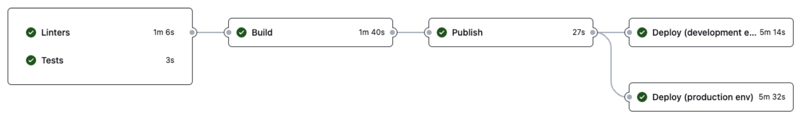

# Documento RFI III

En este documento se recoge la información relativa a las decisiones tomadas en torno al CI/CD y la arquitectura en Cloud. Se analizan aspectos en cuanto a ventajas/desventajas, funcionalidad y aspectos tanto presentes como futuros de las elecciones tomadas.

    
## Tabla de contenidos

<!-- TOC -->
* [Introducción](#introducción)
* [Arquitectura en Cloud](#arquitectura-en-cloud)
  * [Resumen arquitectura previa](#resumen-arquitectura-previa)
  * [Evaluación alternativas en Cloud](#evaluación-alternativas-en-cloud)
    * [Servidor web (API + Frontend)](#servidor-web--api--frontend-)
    * [Base de datos](#base-de-datos)
    * [API Gateway](#api-gateway)
* [Integración continua (CI)](#integración-continua--ci-)
  * [Linting](#linting)
  * [Testing](#testing)
  * [Build](#build)
  * [Publish](#publish)
  * [Deploy](#deploy)
* [Coste de la solución](#coste-de-la-solución)
* [Análisis final de las preguntas](#análisis-final-de-las-preguntas)
<!-- TOC -->

# Introducción

En base a la arquitectura diseñada y creada para el [RFI II](RFI%20II.md), se hará un estudio de las diferentes posibilidades en Cloud y se comenzará la migración. Además, se aplicará integración continua (CI) para asegurar el correcto funcionamiento después de cada cambio.

# Arquitectura en Cloud

    
Debido a los requisitos del cliente, no se ha realizado la implementación total de la arquitectura en Cloud, la cual se finalizará en el plazo del RFP.
En este caso, se hará uso de la tecnología proporcionada por AWS debido a las facilidades provenientes de la asignatura.

## Resumen arquitectura previa

    
A modo de resumen y como orientación para este RFI III, la arquitectura (basada en microservicios) a migrar a Cloud y sobre la que considerar las diferentes posibilidades es la siguiente:
* Microservicio 1: Base de datos, en PostgreSQL
* Microservicio 2: Backend, endpoints API
* Microservicio 3: API Gateway, haciendo uso de Kong

## Evaluación alternativas en Cloud

    
A continuación se resumen las decisiones tomadas respecto al despliegue en Cloud en base a la arquitectura en local previa.

### Servidor web (API + Frontend)

Siendo el primer elemento a probar a desplegar en Cloud, también es el que más consideraciones ha tenido al respecto.
La decisión final al respecto ha sido la de desplegar tanto la API como el *frontend* en un mismo servicio, principalmente, por costes y sencillez. No obstante, se pierden ventajas como la posibilidad de un mayor desacoplamiento o una mayor escalabilidad.

Cabe mencionar, que a pesar de la decisión, se mantiene la posibilidad de desplegar API y *frontend* por separado y a corto plazo, obteniendo así las ventajas previamente mencionadas.

### Base de datos

    
De nuevo, se han considerado varias opciones y, en este caso, la tomada corresponde al despliegue de la base de datos PostgreSQL en un servicio independiente evitando así grandes dependencias (como la actual con el *backend*) y obteniendo un desacoplamiento total. Puede presentar alguna desventaja como un mayor nivel de complejidad para su configuración, pero gracias a lo ya implementado en local y a que también se configurarán otros servicios para otros elementos del despliegue, no se considera como un factor determinante.

No obstante, al hacer uso de un servicio independiente en base a nuestra arquitectura en local dejamos de lado las tecnologías proporcionadas por AWS como RDS. Se mantendrán como posible opción a futuro que dependerá factores como su coste o facilidad de implementación.

### API Gateway

    
Considerando este microservicio como algo prescindible (ya que las peticiones al servidor web se podrían redirigir directamente), aparece la opción de no implementar este elemento.

Sin embargo, y tras varias consideraciones, por el momento se ha optado por seguir la misma arquitectura que en local, implementado Kong API Gateway como un servicio independiente más. De esta forma, se siguen manteniendo aspectos como los logs o protección de ciertos endpoints.

A futuro, se sigue considerando viable la opción de la redirección directa o al empleo de tecnologías propias de AWS de API Gateway.

→ ***[Ver ADR correspondiente](../ADRs/Infrastructure/Deployment.md)***

# Integración continua (CI)

  
A continuación se observa el diagrama final de la *pipeline* implementada:

En base a ello, seguidamente se explican brevemente cada uno de los "nodos" de la *pipeline*.

## Linting

A pesar de suponer un esfuerzo extra tanto para su configuración como por parte de los desarrolladores (por tener que cumplir con ciertos estándares o metodologías de desarrollo), las ventajas son claras, proporcionando calidad de código, aumentando la mantenibilidad y reducción de errores.

En este caso, se ha hecho uso de la herramienta *Super-Linter* que agrega una gran variedad de linters para la mayoría de lenguajes de programación u otro tipo de archivos como Dockerfiles o Markdown. Debido a ello y a su facilidad de configuración, posibilidad de definir el alcance o la severidad de los errores, ha sido la opción final al respecto.

## Testing

Del mismo modo que otros "nodos" de la *pipeline*, supone un esfuerzo extra de implementación y configuración. No obstante, y en mayor medida que los linters, el hecho de implementar testing supone una gran mejoría a la hora de evitar errores graves o errores que puedan afectan a futuro y convertirse en mayores.

Sin embargo, haciendo balance se ha considerado que el esfuerzo es mayor al beneficio para los plazos actuales por lo que solo se ha definido la etapa en blanco.

## Build

Así como los dos puntos anteriores podrían llegar a ser prescindibles, este aspecto se ha considerado como necesario, ya que ahorra mucho tiempo y evita trabajos manuales de repetición.

En este caso, se ha optado por el uso de *makefile*, debido a que se conoce ya la implementación y es suficiente para nuestras necesidades.

## Publish

Se entiende como despliegue el proceso de subir o pushear el artefacto generado por el proceso de build al entorno cloud de AWS.

Considerando lo anterior, también se establece como prioridad la implementación de esta fase en la *pipeline*, ahorrando así mucho tiempo al desarrollador, de manera más notable incluso que la fase de build.

Para este RFI se ha optado por la edición manual de un fichero yml de GitHub Actions para incluir el proceso de despliegue. De nuevo, se evitan algunas Acciones de GitHub Actions por la dificultad de implementación respecto a la opción elegida.

## Deploy

Finalmente, se llega a la fase de deploy, entendiéndolo como el proceso de levantar la infraestructura en el entorno cloud de AWS para servir los artefactos generados y subidos a AWS en el proceso de publish.

Muy similar a la fase anterior y proporciona ventajas similares, mejorando la eficiencia y automatizando tareas manuales, repetitivas y, en algunos casos, complejas.

En este caso, y debido a su obligatoriedad por parte de la asignatura, se hará uso de *Terraform* para esta fase. Sin embargo, a fechas de este RFI, no se ha implementado todavía y queda a la espera de su implementación para el próximo RFI.

Cabe mencionar que se podrá desplegar en entornos diferentes, test y producción, cada uno con sus respectivas características, y que se considerarán para la próxima entrega.

→ ***[Ver ADR correspondiente](../ADRs/Infrastructure/CI_CD.md)***

# Coste de la solución

Se detalla de una mejor manera en el ADR correspondiente. No obstante, y a modo de resumen, el coste total de nuestra solución variaría entre la siguiente horquilla:
**237.72 USD/año** ↔ **983.81 USD/año**

→ ***[Ver ADR correspondiente](../ADRs/Infrastructure/Deployment.md)***

# Análisis final de las preguntas
- ¿Cuáles son los procesos de CI?
Ver [ADR Integración continua (CI)](../ADRs/Infrastructure/CI_CD.md)
- ¿Cuáles son las herramientas CI?
Ver [ADR Integración continua (CI)](../ADRs/Infrastructure/CI_CD.md)
- ¿Cuál es la arquitectura en AWS de la solución?
Ver [Arquitectura](#arquitectura-en-cloud)
- ¿Qué servicios de AWS requiere el sistema?
Ver [ADR Deployment](../ADRs/Infrastructure/Deployment.md)
- ¿Cuál es el plan de despliegue?
Ver [ADR Integración continua (CI)](../ADRs/Infrastructure/CI_CD.md)
- ¿Teneis alguna prueba de parte del sistema funcionando?
Lanzar pipelines / Lanzar aplicación
- ¿Por qué es escalable y elástica la solución?
Ver [ADR Deployment](../ADRs/Infrastructure/Deployment.md)
Ver [ADR Integración continua (CI)](../ADRs/Infrastructure/CI_CD.md)
- ¿Cuáles serán los costes de la solución?
Ver [ADR Deployment](../ADRs/Infrastructure/Deployment.md)

