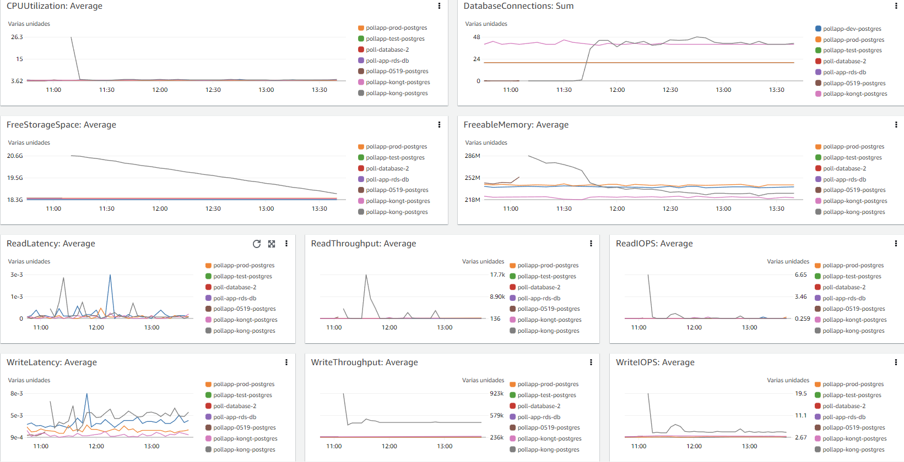
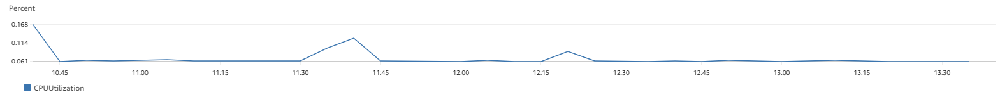
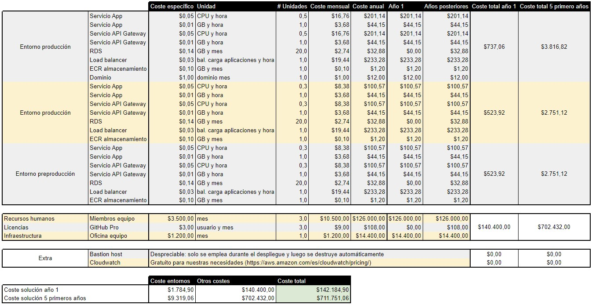

# Documento RFP

En este documento se recogen la conclusiones y decisiones tomadas a lo largo de los RFIs anteriores.
Además, aparecen dos nuevos puntos a tratar: el despliegue total del sistema en AWS y el coste de la solución teniendo en cuenta todos los factores.

    
## Tabla de contenidos

<!-- TOC -->
* [Introducción](#introducción)
* [Despliegue en AWS](#despliegue-en-aws)
* [Métricas/logs](#métricaslogs)
* [Coste de la solución](#coste-de-la-solución)
* [Trabajo futuro o desarrollos pendientes](#trabajo-futuro-o-desarrollos-pendientes)
* [Análisis final de las preguntas](#análisis-final-de-las-preguntas)
<!-- TOC -->

# Introducción

En este documento se plasma el resultado de los RFIs anteriores que derivarán en aspectos como el despliegue en AWS, las métricas/logs y el coste de la solución, todos ellos explicados en los siguientes apartados.
Además, se deja abierto a futuros desarrollos una serie de puntos especificados en el apartado [Trabajo futuro o desarrollos pendientes](#trabajo-futuro-o-desarrollos-pendientes).

# Despliegue en AWS

En general, la arquitectura y configuración de AWS es similar a la que se planteó en el [ADR de despliegue](../ADRs/Infrastructure/Deployment.md) del RFI III.
Sin embargo, hay alguna diferencia. En particular, finalmente se ha optado por implementar una BDD nativa de AWS en lugar de configurar una BDD PostgreSQL en un servicio independiente, con el ahorro de costes y escalabilidad que ello conlleva.

→ ***[Ver ADR correspondiente](../ADRs/Infrastructure/Deployment.md)***

# Métricas/logs

  
En cuanto a las métricas también se nos han presentado varias opciones. No obstante, y debido principalmente a los plazos, se ha optado por emplear el sistema de monitorización integrado de AWS: CloudWatch.
Con esta herramienta podremos crear los dashboards que necesitemos para monitorizar el sistema, así como crear alarmas que nos avisen en caso de que se produzca algún error o se sobrepase algún umbral.

Otras opciones a las que se podría haber recurrido son:
- Prometheus: sistema de monitorización de código abierto que permite la monitorización de métricas y logs.
- Grafana: herramienta de visualización de datos que permite crear dashboards para monitorizar el sistema.
- ELK: conjunto de herramientas que permite la monitorización de logs.
- Datadog: herramienta de monitorización de logs y métricas.
- New Relic: herramienta de monitorización de logs y métricas.

Como se ha mencionado, CloudWatch será la herramienta a utilizar. A continuación se puede observar algunos ejemplos de visualización obtenidos a partir de CloudWatch:
- Panel de monitorización de la BDD: 

    
- Uso de CPU del clúster:

    

# Coste de la solución

A modo de resumen, se presenta la siguiente tabla de presupuestos:

Como se puede observar, se han planteado tres entornos a desplegar: desarrollo, preproducción y producción. Cada uno de ellos tiene un coste asociado, que se detalla en la tabla anterior. Además, se han añadido costes generales asociados a recursos humanos, licencias o infraestructuras.

Con ello, se obtiene un coste total de 1.784,90\$ para el primer año de los entornos y un total de 9.139,06\$ totales para los cinco primeros años.

Por otro lado, los costes generales ascienden a 140.400,00\$ para el primer año y 702.432,00\$ para los cinco primeros años.

De esta forma, el presupuesto presentado total, en el que se incluyen costes desde la aplicación hasta la infraestructura necesaria para el equipo, sería de:
* 142.184,90\$ para el primer año
* 711.571,06\$ para los cinco primeros años

→ ***[Ver ADR correspondiente](../ADRs/Infrastructure/Deployment.md#presupuesto)***

# Trabajo futuro o desarrollos pendientes

  
A continuación se presentan, a modo de lista, varios puntos posibles de mejora o desarrollo futuro:
- Despliegue en otros proveedores: se ha realizado un despliegue en AWS, pero se podría desplegar en otros proveedores como por ejemplo Azure o Google Cloud. Realmente, tampoco se ha llegado a hacer el estudio de alternativas a AWS debido a los requerimientos de la asignatura.
- Pruebas de estrés, carga y rendimiento: se plantean como líneas de mejora, pero no se han realizado debido a los plazos y requisitos de la asignatura.
- Mejora de métricas/logs: se ha optado por CloudWatch, pero se podría mejorar la monitorización del sistema con otras herramientas como Prometheus o Grafana con el objetivo de obtener una mayor y más completa visibilidad del sistema.
- Replanteamiento del coste de la solución: se ha realizado un presupuesto de la solución actual, pero se podría realizar un estudio más detallado de los costes planteando diferentes escenarios, financiaciones, etc.

# Análisis final de las preguntas
- Todas las preguntas anunciadas en los RFI anteriores.
Ver [RFI I](RFI%20I.md)
Ver [RFI II](RFI%20II.md)
Ver [RFI III](RFI%20III.md)
- ¿Cómo se despliega el sistema en AWS?
Ver [Despliegue en AWS](#despliegue-en-aws)
- ¿Cuáles son las métricas/logs para evaluar el funcionamiento del sistema?
Ver [Métricas/logs](#métricaslogs)
- ¿Cuál es la arquitectura del sistema de métricas/logs?
Ver [Métricas/logs](#métricaslogs)
- ¿Cómo se visualizan esas métricas/logs?
Ver [Métricas/logs](#métricaslogs)
- Trabajo futuro o Desarrollos pendientes
Ver [Trabajo futuro o desarrollos pendientes](#trabajo-futuro-o-desarrollos-pendientes)
